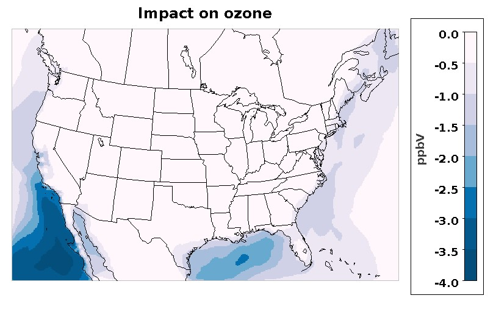

# Revision of halogen-mediated first-order ozone loss (all mechanisms)

[Golam Sarwar](mailto:sarwar.golam@epa.gov), U.S. Environmental Protection Agency

## Brief Description
Halogen chemistry can be an important sink for ozone over oceanic areas from interactions with sea spray. A simple halogen-mediated first-order ozone loss was initially developed by using hemispheric CMAQ results obtained with and without detailed bromine/iodine chemistry for summer months. The detailed bromine/iodine chemistry has recently been updated and hemispheric model simulations were completed with and without the updated bromine/iodine chemistry for an entire year. The simple halogen-mediated first-order ozone loss is developed using the annual hemispheric CMAQ results obtained with and without full bromine/iodine chemistry. The revised halogen-mediated first-order rate constant for ozone loss (units=s&#8209;1) as a function of atmospheric pressure P (units=atm) is:  

These reactions are applied to grid cells over oceanic areas.
 
## Significance and Impact

Model sensitivity runs were completed with the existing and updated simple first order ozone loss (continental U.S. domain) for a 10-day summer period. The updated simple first-order ozone loss reduces average ozone by up to 4.0 ppbV over sea water and by up to 2.0 ppbV over some coastal areas. There is no impact on model run time.

 
Figure 1: Impact of updated simple first-order ozone loss.

## Affected Files
CCTM/src/MECHS/cb05e51_ae6_aq/RXNS_DATA_MODULE.F90
CCTM/src/MECHS/cb05e51_ae6_aq/RXNS_FUNC_MODULE.F90
CCTM/src/MECHS/cb05e51_ae6_aq/mech_cb05e51_ae6_aq.def

CCTM/src/MECHS/cb05e51_ae6nvPOA_aq/RXNS_DATA_MODULE.F90
CCTM/src/MECHS/cb05e51_ae6nvPOA_aq/RXNS_FUNC_MODULE.F90
CCTM/src/MECHS/cb05e51_ae6nvPOA_aq/mech_cb05e51_ae6nvPOA_aq.def

CCTM/src/MECHS/cb05tucl_ae6_aq/RXNS_DATA_MODULE.F90
CCTM/src/MECHS/cb05tucl_ae6_aq/RXNS_FUNC_MODULE.F90
CCTM/src/MECHS/cb05tucl_ae6_aq/mech_cb05tucl_ae6_aq.def

CCTM/src/MECHS/cb6r3_ae6_aq/RXNS_DATA_MODULE.F90
CCTM/src/MECHS/cb6r3_ae6_aq/RXNS_FUNC_MODULE.F90
CCTM/src/MECHS/cb6r3_ae6_aq/mech_cb6r3_ae6_aq.def

CCTM/src/MECHS/cb6r3_ae6nvPOA_aq/RXNS_DATA_MODULE.F90
CCTM/src/MECHS/cb6r3_ae6nvPOA_aq/RXNS_FUNC_MODULE.F90
CCTM/src/MECHS/cb6r3_ae6nvPOA_aq/mech_cb6r3_ae6nvPOA_aq.def

CCTM/src/MECHS/cb6r3_ae7_aq/RXNS_DATA_MODULE.F90
CCTM/src/MECHS/cb6r3_ae7_aq/RXNS_FUNC_MODULE.F90
CCTM/src/MECHS/cb6r3_ae7_aq/mech_cb6r3_ae7_aq.def

CCTM/src/MECHS/racm2_ae6_aq/RXNS_DATA_MODULE.F90
CCTM/src/MECHS/racm2_ae6_aq/RXNS_FUNC_MODULE.F90
CCTM/src/MECHS/racm2_ae6_aq/mech_racm2_ae6_aq.def

CCTM/src/MECHS/saprc07tb_ae6_aq/RXNS_DATA_MODULE.F90
CCTM/src/MECHS/saprc07tb_ae6_aq/RXNS_FUNC_MODULE.F90
CCTM/src/MECHS/saprc07tb_ae6_aq/mech_saprc07tb_ae6_aq.def

CCTM/src/MECHS/saprc07tc_ae6_aq/RXNS_DATA_MODULE.F90
CCTM/src/MECHS/saprc07tc_ae6_aq/RXNS_FUNC_MODULE.F90
CCTM/src/MECHS/saprc07tc_ae6_aq/mech_saprc07tc_ae6_aq.def

CCTM/src/MECHS/saprc07tc_ae6nvPOA_aq/RXNS_DATA_MODULE.F90
CCTM/src/MECHS/saprc07tc_ae6nvPOA_aq/RXNS_FUNC_MODULE.F90
CCTM/src/MECHS/saprc07tc_ae6nvPOA_aq/mech_saprc07tc_ae6nvPOA_aq.def

CCTM/src/MECHS/saprc07tic_ae6i_aq/RXNS_DATA_MODULE.F90
CCTM/src/MECHS/saprc07tic_ae6i_aq/RXNS_FUNC_MODULE.F90
CCTM/src/MECHS/saprc07tic_ae6i_aq/mech_saprc07tic_ae6i_aq.def

CCTM/src/MECHS/saprc07tic_ae6invPOA_aq/RXNS_DATA_MODULE.F90
CCTM/src/MECHS/saprc07tic_ae6invPOA_aq/RXNS_FUNC_MODULE.F90
CCTM/src/MECHS/saprc07tic_ae6invPOA_aq/mech_saprc07tic_ae6invPOA_aq.def

UTIL/chemmech/src/wrt_reactions_module.f

## References

Sarwar, G.; Gantt, B.; Schwede, D.; Foley, K.; Mathur, R.; Saiz-Lopez, A., 2015: Impact of enhanced ozone deposition and halogen chemistry on tropospheric ozone over the Northern Hemisphere, _Environmental Science & Technology_, **49**(15):9203-9211.

-----
## Internal Records
#### Relevant Pull Requests:
[PR #328](https://github.com/usepa/cmaq_dev/pull/328)
#### Commit IDs:
5dd2890b6743bc1c0c6f94542f2565a517d8daeb

-----
