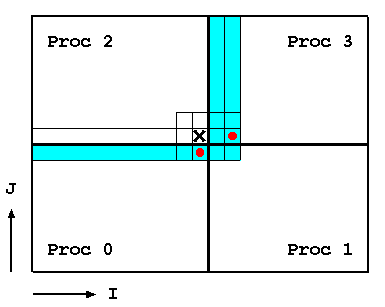
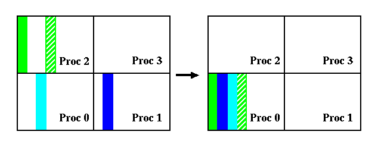
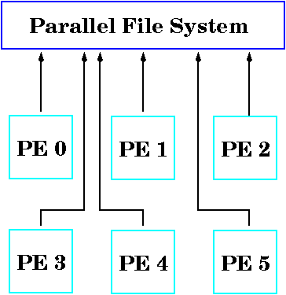

<!-- BEGIN COMMENT -->

[<< Previous Appendix](CMAQ_UG_appendixC_spatial_data.md) - [Home](../README.md)

<!-- END COMMENT -->


# Appendix D: Parallel Implementation of CMAQ

## 1. General Structure of data

There are a few approaches to parallelize an application, such as data-parallelism. Data-parallelism is a paradigm which decomposes data into "equal" sections and distributes them among allocated processors. Each processor works on the portion it owns. CMAQ parallel implementation is based on this methodology.

CMAQ model operates on a 4D space (ncols, nrows, nlays, nspcs) and only the spatial domain is decomposed. When NPROCS number of processors is used to run CMAQ, NPCOL number of process out from NPROCS processors is assigned to the column dimension and the remaining NPROW number of processors is assigned to the row dimension (NPROCS = NPCOL x NPROW). In the case that the column dimension is not divisible by NPCOL, the remainder is distributed equally to NPCOL processors. The same thing applies to the row dimension. For example (illustrated in Figure D-1), given a 100 by 75 (column x row) data grid and six processors with three processors along the column dimension and two processors along the row dimension, the subdomain size in each processor (NCOLS x NROWS): PE 0 is 34 x 38, PE 1 and PE 2 are 33 x 38, PE 3 is 34 x 37, PE 4 and PE 5 are 33 x 37.


**Figure D-1. Domain decomposition illustration**

## 2. Interprocessor Communication

In some science processes such as advection, a processor requires data from neighboring processors (interprocessor communication) when the model runs on a distributed memory system. An interprocessor communication library, STENEX, was developed to provide simple and robust interface to handle various kinds of near neighbor communication. Near neighbor is defined as processors which are adjacent to itself (blue block) in the eight major geographical directions: N, NE, E, SE. S, SW, W, and NW (Fig. D-2).


**Figure D-2. A depiction of near neighbor processors**

As an illustration of interprocessor data access (Fig. D-3), consider the following piece of code executing on Processor 2 with a 2x2, 4-processor domain decomposition. It is clear that calculation at grid cell denoted by "X" requires data denoted by red dots which resided in near neighbor processor 0 and 3.

 DIMENSION DATA( NCOLS, NROWS )</br>

 DO J = 1, NROWS</br>
   DO I = 1, NCOLS</br>
       DATA(I,J) = A(I+2,J) * A(I, J-1)</br>
    END DO</br>
 END DO

 

 **Figure D-3. An example to show interprocessor data access is needed**

 To facilitate interprocessor communication as shown in the example above, "ghost" regions are used (extra space in the data structure), i.e. DIMENSION DATA (NCOLS+2, NROWS+1). Thickness of the ghost region depends of the amount of overlap that is required by the algorithm.

 The Stencil Exchange (SE) Library is designed in Fortran 90 language using Object Oriented-base technology to handle various types of communication with the objective of hiding the management of the low-level data movement. SE addresses four types of communication and brief description of each type is followed.

 * interior to ghost region, which is indicated in light blue in Figure D-4. This particular type of communication is being used in various places such as HADV and HDIFF.


**Figure D-4. Interior to ghost region communication**

* sub-section data redistribution (Fig. D-5). This particular type of communication is being used in Process Analysis.


**Figure D-5. Sub-section data redistribution communication**

* The last two type of communication are interior to interior (Fig. D-6) and selective data collection (Fig. D-7) which both were used in PinG and PinG was no longer supported in CMAQ.


**Figure D-6. Interior to interior communication**



**Figure D-7. Selective data collection**

## 3. Parallel I/O

All I/O operations in CMAQ are handled by IOAPI_3 library. Furthermore, IOAPI_3 library was designed for serial code. As a result, CMAQ won't be able to utilize any I/O functions such as READ3 and WRITE3 in IOAPI library directly in any parallel computing platform. 

CMAQv4.7.1 and later releases include a directory call 'PARIO' which was developed to bridge this gap. PARIO contains a smaller set of functions which are equivalent counterpart in IOAPI but capable to run in parallel. The following IOAPI_3 routines have PARIO equivalents: READ3, INTERP3, WRITE3, CHECK3, OPEN3, CLOSE3, DESC3, M3ERR, M3EXIT, M3WARN. Each file name in PARIO library has a "P" prefix to distinguish its counterpart in IOAPI library, e.g. POPEN3 and PINTERP3. Substitution with the PARIO subroutines is done at compilation through CPP flags. Note that subroutine argument lists in any PARIO routine is identical to IOAPI_3 counterpart routine.

On the output side, all processors are required to send their portion of data to processor 0, which will stitch each sub-part and then output it to the file (Fig. D-8). This is considered a “pseudo” parallel I/O approach and this approach is being using in PARIO.


**Figure D-8. Combine all sub-domain data from each processor in an I/O processor**

In CMAQv5.2 and later versions, we have developed a true parallel I/O approach, referred to as PIO (Wong et. al.). PIO allows each processor to write their portion to the file simultaneously (Fig. D-9).



**Figure D-9. True parallel I/O approach**

Users can turn on this feature by uncommenting the following line in bldit_cctm.csh at the model build step and link with IOAPI 3.2.

#set build_parallel_io                 #> uncomment to build with parallel I/O (pnetcdf);
 
Users must also edit the CCTM run script by inserting MPI: in front of the output file path as shown below:

  setenv CTM_CONC_1      "MPI:$OUTDIR/CCTM_CONC_${CTM_APPL}.nc -v"       #> On-Hour Concentrations
  
This approach also requires installation of "mpi" IOAPI libraries as shown below (note these steps should be followed after completing the steps in Chapter 3 section 3.2.3): 

```
setenv BIN Linux2_x86_64gfortmpi
```

Edit the file in the ioapi folder called Makeinclude.Linux2_x86_64gfortmpi to comment out all openMP options as CMAQ does not support openMP. Note: If users are using the ifort compiler you also need to remove -Bstatic flag within the ioapi/Makeinclude.Linux2_x86_64ifortmpi file as well.

```
OMPFLAGS = # -fopenmp 
OMPLIBS = # -fopenmp
```

In the top level IOAPI_3.2 directory run: 
```
make configure
make
```

For further directions on installation of PIO please contact David Wong at wong.david-c@epa.gov

### Reference:

Wong, D.C., Yang, C.E., Fu, J.S., Wong, K., & Gao, Y. (2015). An approach to enhance pnetCDF performance in environmental modeling applications. Geosci. Model Dev., 8, 1033-1046.

[<< Previous Appendix](CMAQ_UG_appendixC_spatial_data.md) - [Home](../README.md)<br>
CMAQ User's Guide (c) 2019<br>
