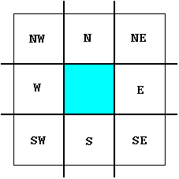
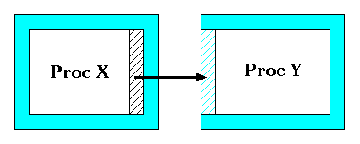
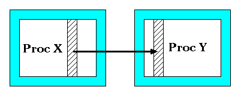

# Appendix D: Parallel Implementation of CMAQ

## 1. General Structure of data

There are a few approaches to parallelize an application, such as data-parallelism. Data-parallelism is a paradigm which decomposes data into "equal" sections and distributes them among allocated processors. Each processor works on the portion it owns. CMAQ parallel implementation is based on this methodology.

CMAQ model operates on a 4D space (ncols, nrows, nlays, nspcs) and only the spatial domain is decomposed. When NPROCS number of processors is used to run CMAQ, NPCOL number of process out from NPROCS processors is assigned to the column dimension and the remaining NPROW number of processors is assigned to the row dimension (NPROCS = NPCOL x NPROW). In the case that the column dimension is not divisible by NPCOL, the remainder is distributed equally to NPCOL processors. The same thing applies to the row dimension. For example, given a 100 by 75 (column x row) data grid and six processors with three processors along the column dimension and two processors along the row dimension, the subdomain size in each processor (NCOLS x NROWS): PE 0 is 34 x 38, PE 1 and PE 2 are 33 x 38, PE 3 is 34 x 37, PE 4 and PE 5 are 33 x 37.

**Figure D-1.**

## 2. Interprocessor Communication

In some science processes such as advection, a processor requires data from neighboring processors (interprocessor communication) when the model runs on a distributed memory system. An interprocessor communication library, STENEX, was developed to provide simple and robust interface to handle various kinds of near neighbor communication. Near neighbor is defined as processors which are adjacent to itself (blue block) in the eight major geographical directions: N, NE, E, SE. S, SW, W, and NW.

**Figure D-2.**

As an illustration of interprocessor data access, consider the following piece of code executing on Processor 2 with a 2x2, 4-processor domain decomposition. It is clear that calculation at grid cell denoted by "X" requires data denoted by red dots which resided in near neighbor processor 0 and 3.

 DIMENSION DATA( NCOLS, NROWS ) 

 DO J = 1, NROWS 
   DO I = 1, NCOLS 
       DATA(I,J) = A(I+2,J) * A(I, J-1) 
    END DO 
 END DO

 

 **Figure D-3**

 To facilitate interprocessor communication, "ghost" regions are used, i.e. DIMENSION DATA (NCOLS+2, NROWS+1). Thickness of the ghost region depends of the amount of overlap that is required by the algorithm.

 The Stencil Exchange (SE) Library is designed in Fortran 90 language using Object Oriented-base technology to handle various types of communication with the objective of hiding the management of the low level data movement. In this version, the library is extended to handle two grid structures: coarse grid, which is denoted by a character 'c' or 'C', and find grid, in the application. In addition, currently SE addresses four types of communication:

 1. interior to ghost region, which is indicated in light blue in the following figure:

**Figure D-4**
2. interior to interior:

**Figure D-5**

3. sub-section data redistribution:

**Figure D-6**

and 4. selective data collection:

**Figure D-7**

Details of all these four schemes can be obtained through request.

## 3. Parallel I/O

All I/O operations in CMAQ are handled by IOAPI_3 library. However, IOAPI_3 library was designed for serial code only and it does not work in a distributed memory environment where domain decomposition has been used. PARIO library was developed to perform file I/O for CMAQ applications running on distributed memory platforms. To maintain efficiency and correctness we have developed parallel access routines that have equivalent functionality and are effectively layered on top of the standard IOAPI_3. The following IOAPI_3 routines have PARIO equivalents: READ3, INTERP3, WRITE3, CHECK3, OPEN3, CLOSE3, DESC3, M3ERR, M3EXIT, M3WARN. The convention adopted is to use a "P" prefix for the parallel version. Hence POPEN3, PINTERP3, etc. substitution of the PARIO subroutines is done in a precompilation step. Note that the interface (i.e., the argument lists) to IOAPI_3 routines and their PARIO equivalents is identical.

On the output side, all processors are required to send their portion of data to processor 0, which will stitch each sub-part and then output it to the file. This is considered a “pseudo” parallel I/O approach.

**Figure D-8**

Recently we have developed a true parallel I/O approach, which allows each processor to write their portion to the file simultaneously (Wong et. al.).

**Figure D-9**

This approach has been incorporated into IOAPI version 3.2. Parallel I/O scheme has been implemented in CMAQ 5.2. The user is required to turn on this feature at the model build step and link with IOAPI 3.2.

### Reference:

Wong, D. C., Yang, C. E., Fu, J. S., Wong, K., and Gao, Y., “An approach to enhance pnetCDF performance in environmental modeling applications”, Geosci. Model Dev., 8, 1033-1046, 2015.
