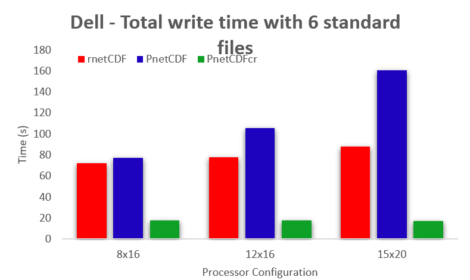
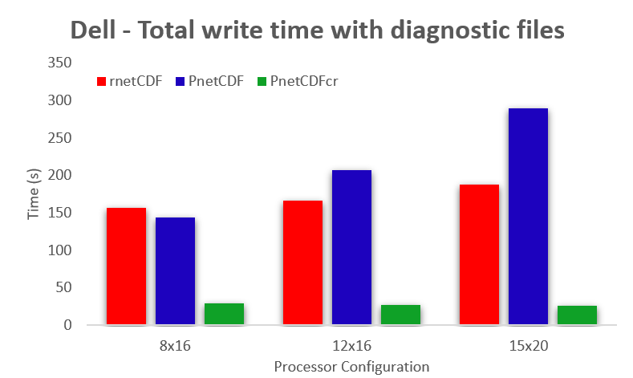

## CMAQ Tutorial 
### Strategies to Improve CMAQ Model Runtime 
Purpose: This tutorial shares common options and strategies that CMAQ developers recommend for improving model runtimes on common systems.


------------
#### Linux Environment Settings

```
limit stacksize unlimited 
```

#### HPC Queue Manager Options

One consideration is to reserve the entire node that CMAQ is running on so that the simulation can make use of maximum resources. In the SLURM queue manager, you can use the following option.
```
#SBATCH --exclusive
```

#### Run time Processor Configuration Settings

When a job is running on a distributed system, you need to provide values for this pair of variables:

```
@ NPCOL  = m; @ NPROW =  n
```

where m should be <= n and m and n should be as close to SQRT(m*n) as possible.


#### True Parallel IO Operation in CMAQ

To utilize this option, please go through this check list:

* Have PnetCDF installed and the underlying computing system should have parallel file system, e.g. Lustre or Beefs
* Have "set build_parallel_io" this line uncommented inside bldit_cctm.csh when you are ready to build CMAQ
* Have an appropriate version of IOAPI 3.2 installed (please contact David Wong at wong.david-c@epa.gov for additional information)
* Have "MPI:" prefix inserted in all output file In the run script, e.g. setenv S_CGRID "MPI: $OUTDIR/CCTM_CGRID_${CTM_APPL}.nc"

Here are some example of CMAQ Parallel IO performance on various systems with different parallel file system. In each figure, rnetCDF denotes the I/O methodology current CMAQ is using, PnetCDF denotes the application of straight PnetCDF parallel I/O scheme, and PnetCDFcr denotes the new scheme we have developed based upon PnetCDF (reference below) 

* with Lustre parallel file system (Edison and Kraken were among the world fastest supercomputers a few year ago):


* with BeeGFS parallel file system which is available for free:





Wong, D.C., Yang, C.E., Fu, J.S., Wong, K., & Gao, Y. (2015). An approach to enhance pnetCDF performance in environmental modeling applications. Geosci. Model Dev., 8, 1033-1046.

