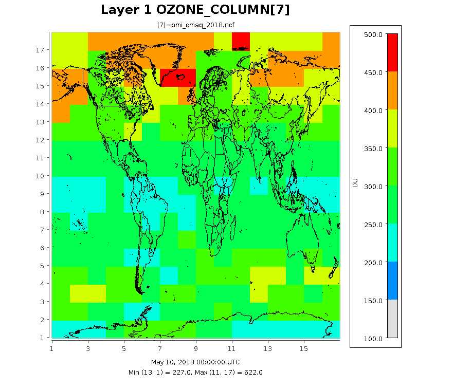
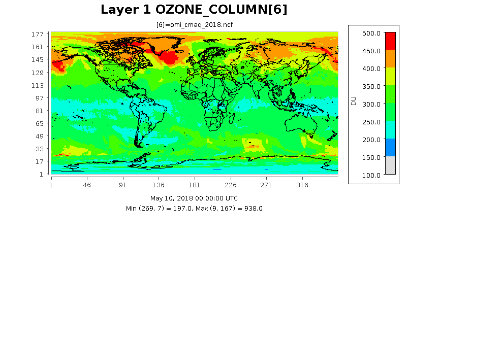
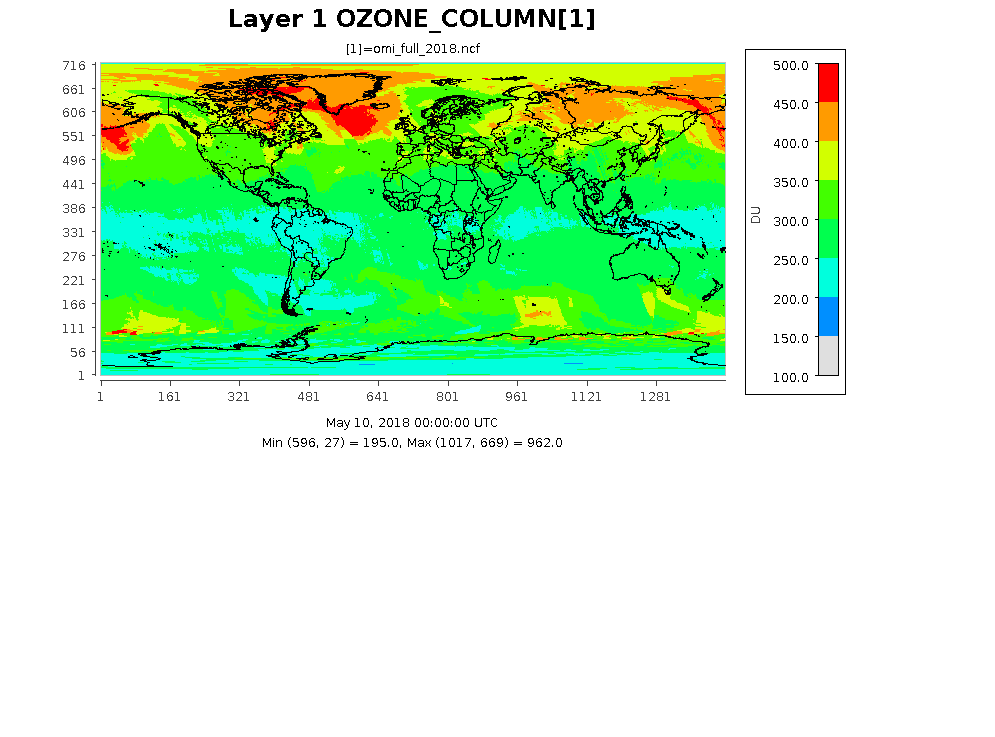

# create_CMAQ_OMI_file Utility

The utility creates the OMI input file describing how total ozone column density varies over the globe and time.
The file supports CMAQ model's in-line calculation of photolysis rates. Creating the OMI file involves processing 
observations from satellites, ASCII files for the latitude/longitude distribution of the ozone column for a calendar 
day. The utility also creates IOAPI files for visualizing observations and the OMI file's data. They can 
differ because the utility interpolates observations to horizontal resolution of the OMI file. The resolution is 
an option specified by the utility's run-script.

### Building the Utility

Compiling the utility requires a **FORTRAN** compiler, **netcdf** and **IOAPI**. 
If the requirements are met, a user has the below options.  

   1. Option One:  
      - Copy src directory.
      - Go into the new directory and modify the Makefile to define the library and include paths for netcdf and
        IOAPI.
      - Set the environment variable _compiler_ to intel, pgi or gcc based on the user's 
   preference.  
      - Type "make clean" then type "make".  
      
   2. Option Two, _requires the bldmake utility for the CMAQ model_: 
       - Copy to a work directory and modify the _bldit_ script under the _scripts_ subdirectory.   
       - Type bldit_create_CMAQ_OMI_file.csh _compiler_. 
       -  Go into the created build directory, type "make clean" and type "make".
       
### Using the Utility for creating an OMI file

#### Satellite Inputs

To create an OMI file, data for total ozone column density is required. The utility can use daily ASCII files from two 
sources via the wget or curl command.  

      
   1. NASA TOMS ftp site:  
      - ftp://toms.gsfc.nasa.gov/pub/omi/data/Level3e/ozone

   2. NASA OPeNAP website: 
       - http://acdisc.gsfc.nasa.gov/opendap/HDF-EOS5/Aura_OMI_Level3/OMTO3d.003   
       - requires creating an account and local _cookies_
       
Both sources were lasted accessed in March of 2019.

The scripts directory contains an example for getting data from the TOMS ftp site, _scripts/get_toms_data.q_.
When obtaining data files, we recommend getting files bracketing the desire peroid by several days because 
observations may not available within given latitude/longitude ranges. The omission can occur because of the 
satillite's orbit, polar night, or equipment failure. To go around the problem, the utility uses 
the last available observation or the mean value for a location, in respective presidence. For robust and more useful
output files, several months of data are suggested.

After downloading data, check the file for \*\*\* strings and replace each with the string '   0' which denotes a
missing value. Sometimes, the former string passes through quality control procedures.
      
#### Running the Utility   

The script subdirectory includes a run-script for the utility, _scripts/cmaq_omi_env.q_. 
A user should Copy and modify the script before running it. The script sets several environment 
variables that are runtime options for the utility. The below table lists and describes these options. Note that
the Defaults values were used to create the OMI file the CMAQ repository under CCTM/src/phot/inline and that 
the output data is centered and symmetric about the equator.

Runtime Options

|Option         |Description                                            | Default Value |  
|:--------------|:------------------------------------------------------|:----:|
| OMI_FILE_LIST | List of data files to process, sorted by calendar date     | omi_file.txt |
| PREV_DATE     | Replace missing observation with last previous observation | True |
| NLAT_OMI      | Number of latitude points in output. Value should be odd and equal or greater than 17 | 17 |
| NLON_OMI      | Number of longitude points in output. Value should be odd and equal or greater than 17 | 17 |
| LAT_BORDER    | Degrees between the first latitude point from adjacent pole. Value cannot be less than observation | 10 |
| FULL_FILES    | output ASCII and IOAPI file at full lat/lon resolution of observations. Not used by the CMAQ model. | False |
| OMI_FULL_DAT  | OMI data (ASCII) at Lat/Lon Resolution of Observations | omi_full.dat |
| OMI_FULL_NCF  | OMI data in IOAPI format for visualation at Lat/Lon Resolution of Observations | OMI_FULL_NCF |
| OMI_CMAQ_DAT  | Processed OMI file (ASCII) for the CMAQ model  | omi_cmaq.dat |
| OMI_CMAQ_NCF  | Processed OMI file in IOAPI format for visualation | OMI_CMAQ_NCF |

####  Example Images extracted from IOAPI files.  

The following images show the ozone column at three different resolution for the same date. 

1.   10 by 22.5 degree Lat/Lon Resolution (default values) currently used in OMI data file under **CCTM/src/phot/inline**.

2.   1 by 1 degree Lat/Lon Resolution as determined by the settings in _scripts/cmaq_omi_env.q_.

2.   0.25 by 0.25 degree Lat/Lon Resolution taken from the OMI_FULL_NCF file.

